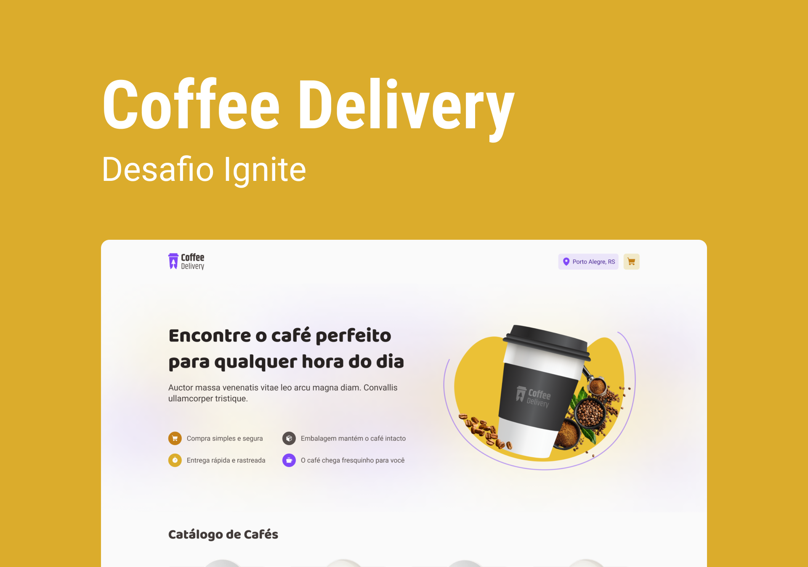

# React JS - Ignite - Desafio 01

Aplicação de controle de tarefas no estilo **to-do list**.




## Funcionalidades

- Adicionar/remover cafés ao carrinho;
- Aumentar/diminuir quantidade de cafés do carrinho
- Fazer o pedido.


## Stack utilizada

**Front-end:**
- ReactJS
- Vite
- TypeScript


## Rodando localmente

Clone o projeto

```bash
  git clone https://github.com/fellipebastos/ignite-react-js-desafio-2.git
```

Entre no diretório do projeto

```bash
  cd ignite-react-js-desafio-2
```

Instale as dependências

```bash
  npm install
```

Inicie o servidor

```bash
  npm run dev
```


## Autores

- [@fellipebastos](https://www.github.com/fellipebastos)

